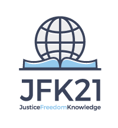

Title : Jorden Frihed Kundskab

Title Note : Et nyt dansk parti

E V E N T :     24. august kl 17 - 21    tickets + info:   https://billetto.dk/da/jordenfrihedkundskab

[TITLE]

# En bæredygtig økonomi

sikres FØRST og FREMMEST af: 

En Folkeejet Nationalbank, der udsteder gældsfrie og rentefrie penge direkte ind på den enkelte borgers konto i den Folkeejede Nationalbank i form af Borger Dividende. Alle borgere får een aktie hver i den Folkeejede Nationalbank. Til de der ønsker at vide i praksis, hvordan det søges gjort, henvises til ”[Monetary Reform on Iceland](https://www.forsaetisraduneyti.is/media/Skyrslur/monetary-reform.pdf)”. Vi vil arbejde på, at alle lande i EU nationaliserer deres privatejede og privatkontrollerede centralbanker. 

Den voldsomme stigning i pengemængden af bank–producerede penge med rente har forårsaget den store inflation i ejendomspriserne. "Seddelpressen" bør således ikke varetages af privatejede virksomheder, som har profit som motiv.

Dette, kombineret med en større skatteomlægning og effektivisering af den offentlige sektor, sikrer hele befolkningen muligheden og retten til et liv i tryghed, et sted at bo og nok økonomi til at man kan klare sig i værdighed. Retten til at kunne opbygge sin karriere eller virksomhed uden unødvendigt bureaukrati og beskatning skal cementeres. Ved at fjerne selskabsskatten fuldstændigt og erstatte den med en omsætningsskat på digitale pengetransaktioner sikrer man, at alle virksomheder, store som små, bidrager ligeligt til samfundets opretholdelse. 

En væsentlig del af menneskets frihed er et mere overskueligt regelsæt og således søges administrationen nedbragt såvidt muligt. Besparelsen heraf skal specielt komme de lavestlønnede til gode.

Det er en menneskeret at have et sted at bo. Et rigt land som Danmark skal garantere det. Specielt set i lyset af de enorme gevinster der har været på ejendomsmarkedet i form af stigninger i ejendomspriserne.

Det er primært virksomhederne, der skal betale grønne afgifter, da det er dem, der forurener mest. Og virksomheder der forurener, skal fremover løbende hensætte passende beløb til rensningen af miljøet.

Landbruget skal inden for 5 år omlægges til at producere varer, der er 100% statskontrolleret økologisk uden GMO og pesticider. Der er langt større dækningsbidrag ved denne produktion, og således benyttes et mindre areal af Danmark til en ganske vist mindre produktionen men dog til den samme indtægt. Helt op imod 30% af Danmarks areal vil således kunne frigøres til anden produktion, herunder rekreative formål og turisme. Vi har stor ekspertise på produktion af fødevarer i Danmark. Nu er det på tide at gå næste skridt i retning af en mere mangfoldig madproduktion. Dette vil skabe nye økosystemer i stedet for at ødelægge de nuværende med monokultur.

Vi  ønsker at flytte beskatningen fra indkomst til i stedet at beskatte forbrug, omsætning og resourcer. Dette gør vi for at øge fokus på de dele af samfundet, der skaber den reele værditilvækst til gavn for alle borgeres velfærd. Ligeledes bliver enhver form for skattetænkning meget vanskeligere, og mennesker og virksomhederne kan koncentrere sig om effektiviteten af produktionen i stedet. Og ved at beskatte ressourcer sikres, at der ikke bliver brugt mere, end højst nødvendigt.

# Menneskets frihed

Det næste tema er menneskets frihed. Frihed fra et stigende antal regler, som ikke engang myndighederne, der er ansat til at varetage dem, mestrer fuldt ud. Borgerens retssikkerhed skal øges og sikres upartiske afgørelser i tvister med offentlige institutioner og private virksomheder. Frihed fra unødvendig beskatning er en menneskeret. Specielt multinationale virksomheder går ofte fri fra at bidrage til samfundet.  

Magten søges så vidt muligt decentraliseret. Væk fra en stor tung, svært overskuelig statslig administration over til mere overskuelig lokal administration, med så mange beslutninger som muligt truffet så tæt på borgeren som muligt. Øget fleksibilitet i arbejdstiderne i form af flekstid, deltid, 7/7-ordninger. Borgerombudsmanden skal i stigende grad medvirke til at sikre den enkelte borgers rettigheder, og sikre at alle sager bliver vurderet af en instans af uvildige. Nemmere adgang til folkeafstemninger og mere direkte demokrati.

Menneskets frihed er bedre varetaget af et folkevalgt Europa Parlament med indflydelse, end, som nu, af den udpegede ikke folkevalgte Kommission. Derfor ønsker vi en folkeafstemning om Danmarks fortsatte medlemsskab af EUs nuværende udemokratiske struktur. Danmark skal ikke indgå såkaldte ”Frihandelsaftaler”, der begrænser den danske stats ret til at lovgive og regulere livet i Danmark. Der skal være en øget lovgivning, som minimerer monopoler, således at den frie konkurrence får lettere ved at udfolde sig.

Danmark skal ikke kunne deltage i krige uden en forudgående folkeafstemning. Herunder inkluderes konventionel krig, handelskrig, finansiel krig, geo-ingeneering, miljøkrig, informationskrig, krig ved brug af terrorhandlinger og krig ved organiseret masseimmigration. Der bør i stedet arbejdes på fred og på at genopbygge de lande, der har været igennem disse forfærdelige krige. Det vil være den bedste løsning til spørgsmålet om flygtninge. 

Alle lån fra IMF og World Bank bør være rentefrie, ellers er der ikke megen tale om hjælp, men mere tale om forretning. Under den nuværende udformning kan Danmark ikke støtte disse institutioner. U–lande bør så vidt muligt eftergives deres u–landsgæld. Mange af dem har allerede betalt både to og tre gange så meget i rente, som de har fået i lån gennem tiden.

Ret skal være ret, derfor skal whistleblowers beskyttes. De kæmper for vores alle sammens frihed. Det gælder alle, der er villige til at afsløre korruption, konspiration, overgreb og tvang, misbrug og svindel. Det gælder alle områder af samfundet, både det civile, statslige, kommercielle og militære.  

# Kundskab

Forskning bør ikke dikteres af store korporationer og deres kommercielle interesser. Forskere bør ikke bruge halvdelen af deres arbejdstid på at tigge om fondsmidler fra bl.a. disse korporationer. Det skal heller ikke være muligt for disse via lobbyisme at forhindre forskning i visse emner. Viden om menneskelivet udspringer af naturen, og så længe mennesker ikke lever i harmoni med naturen, bekæmper den naturen. Vi ønsker at naturvidenskab og videnskab genfinder sin harmoni med naturen, så vi sikrer en bæredygtig fremtid for alle på jorden. Eksempelvis skal forskning og udvikling indenfor helt nye teknologier af ikke-forurenende energiproduktion kraftigt forøges.

Videnskabelig svindel og manipulering af videnskab for politiske motiver skal i langt højere grad kunne straffes. Det gælder både virksomheder, politikere og videnskabsfolk, der har medvirket til den slags.

Således skal universiteterne udover patenterbar syntetisk medicin også kunne uddanne i naturlig upatenterbar medicin og et langt bredere spektrum af sundhedsfremmende praksis. 

Medier skal kunne gøres ansvarlige for misinformation. I det omfang, de ukritisk viderebringer propaganda, skal de kunne konfronteres med dette ansvar, redegøre eksakt for deres informationskilder og tvinges til dementi og korrektion af informationerne. Der skal således være lettere adgang til at få dementeret beviseligt falske informationer, der bliver spredt i medierne. 

Retten til fuld aktindsigt iflg. Offentlighedsloven skal genetableres. Det gælder også de beslutninger, der bliver truffet af det danske Folketing. Det skal ikke være muligt for politikere at unddrage sig demokratiet ved at hemmeligholde beslutningernes forudsætninger. 

Der skal rettes op på den udhuling af uddannelsernes kvalitet, der har fundet sted over årtier. Desuden skal uddannelsesstederne give plads til ny viden også indenfor kontroversielle emner, så længe disse er baseret på facts og grundig kildekritik. Højere uddannelser skal igen være steder, hvor ægte kritisk tænkning kan finde sted i stedet for blot reproduktion efter færdige skabeloner. Forudsætningen skal starte allerede i den grundlæggende skoling. En folkeskolereform der tager udgangspunkt i det enkelte barns trivsel. Man lærer bedst i en skole man holder af at være i. Der skal tages hensyn til det enkelte barns indlæringssystem. Der skal undervises metodisk, således at de studerende i stigende grad lærer at kunne tænke kritisk og selvstændigt. 

----

Det koster 240 kr. per år at blive medlem af Jorden Frihed Kundskab. [Udfyld tilmeldingsblanketten](http://kortlink.dk/mqw2) for at blive medlem.

[Tilmeld dig nyhedsbrevet](http://eepurl.com/b9-jSf) og giv samtidig en støtteerklæring til Jorden Frihed Kundskab. 

En støtteerklæring angiver at du muligvis er interesseret i at støtte partiet. Efter godt en uge vil du modtage en mail fra `noreply@vælgererklæring.dk` og hvis du mener, at partiet bør kunne opstille til næste valg, så skal du følge anvisningerne i mailen, logge ind via NEMID og give os en vælgererklæring. 

Det hele tager ca. 1 minut. 

----

> Skriv til info@jfk21.com med spørgsmål eller ideer.

> For generel info send en mail til      info-om@jfk21.dk      og modtag svar med links og info. 

> Medlemskab. DKK 240 per år.

> Bank: Arbejdernes Landsbank Konto: 5301 0263080 | IBAN: DK4553010000263080 | SWIFT: ALBADKKK

> Bank: Merkur Konto: 8401 1298811

> SWIPP: 30303740

~ sidelogo
 
{ #thelogo }
~
